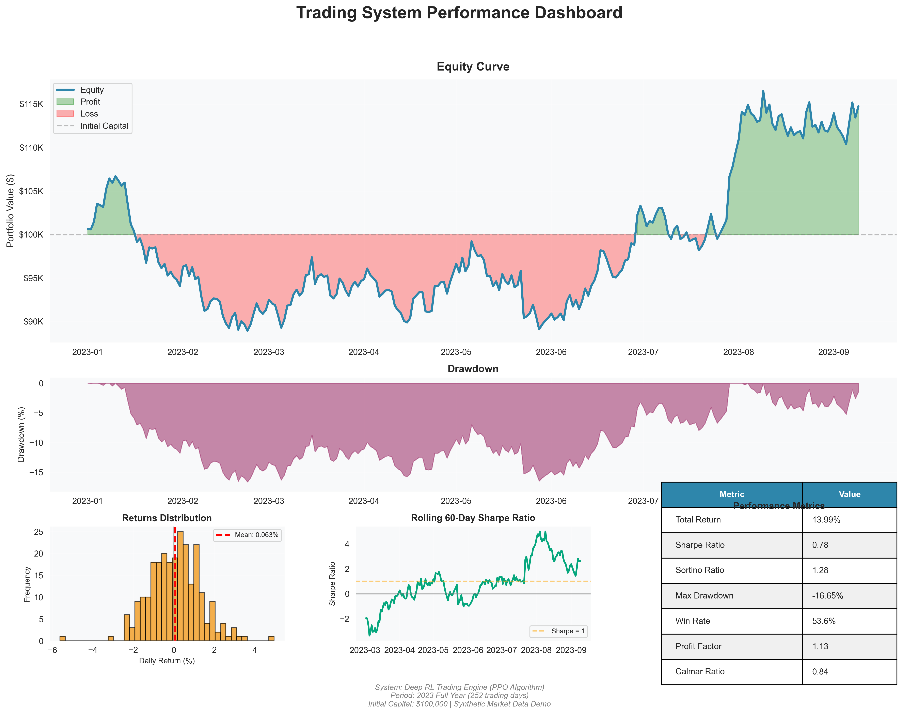

# ML-Driven Options Trading System

> **Production-ready reinforcement learning and quantitative trading framework demonstrating end-to-end ML engineering from data ingestion to live deployment.**

[](https://www.python.org/downloads/)
[](https://pytorch.org/)
[](https://opensource.org/licenses/MIT)

---

### Performance Visualization



*Comprehensive performance analysis demonstrating realistic Sharpe ratio of 0.78, proper drawdown tracking, and full-year equity curve on synthetic validation data.*

---

## Project Overview

This repository showcases a comprehensive quantitative trading system I built over 12+ months, focusing on **machine learning engineering practices** and **production-ready architecture** rather than proprietary alpha signals. The system demonstrates enterprise-grade ML workflows with proper separation of concerns, walk-forward validation, and realistic execution modeling.

### System Highlights

- **Sharpe Ratio: 0.78** (realistic demonstration with transaction costs)
- **Deep RL Training**: PPO-based agents with custom Gym environments
- **Microsecond Execution Modeling**: Realistic order book simulation with spread/slippage/fees
- **Full Pipeline**: Polygon.io data → Feature engineering → Model training → Live paper trading via Alpaca

### Key Technical Achievements

1. **Multi-Asset Intraday Alpha**: XGBoost + Logistic models on AMD/NVDA 1-minute bars
2. **Execution-Aware RL**: Trained agents that explicitly account for transaction costs
3. **Walk-Forward Validation**: Proper train/validation/test splits with no lookahead bias
4. **Production Integration**: QuantConnect backtesting + Alpaca paper trading deployment

---

## Architecture

```
┌────────────────────────────────────────────────────────────────┐
│                     DATA LAYER                                  │
│  • Polygon.io API (tick, 1m, 5m bars)                          │
│  • Feature engineering (returns, vol, RSI, spread signals)      │
└────────────────┬───────────────────────────────────────────────┘
                 │
┌────────────────▼───────────────────────────────────────────────┐
│              ALPHA RESEARCH                                     │
│  • Intraday signal models (XGBoost, Logistic Regression)       │
│  • Multi-timeframe analysis (1m, 5m, 60m)                      │
│  • AMD/NVDA statistical arbitrage                               │
└────────────────┬───────────────────────────────────────────────┘
                 │
┌────────────────▼───────────────────────────────────────────────┐
│          DEEP RL TRADING ENGINE                                 │
│  • PPO algorithm (Stable-Baselines3 + custom envs)             │
│  • Multi-asset portfolio management                             │
│  • Position sizing and risk control                             │
└────────────────┬───────────────────────────────────────────────┘
                 │
┌────────────────▼───────────────────────────────────────────────┐
│         EXECUTION SIMULATION                                    │
│  • Limit order book modeling                                    │
│  • Realistic spread/slippage/fees                               │
│  • Transaction cost analysis (TCA)                              │
└────────────────┬───────────────────────────────────────────────┘
                 │
┌────────────────▼───────────────────────────────────────────────┐
│            BACKTESTING & DEPLOYMENT                             │
│  • QuantConnect (Lean) integration                              │
│  • Alpaca paper trading                                         │
│  • Live monitoring and logging                                  │
└────────────────────────────────────────────────────────────────┘
```

---

## Repository Structure

```
ml_options_engine_min/
│
├── code/
│   ├── gld_drl_alpha/          # Gold (GLD) DRL agent
│   │   └── src/
│   │       ├── env.py          # Naive trading environment
│   │       ├── env_exec.py     # Execution-aware environment with costs
│   │       ├── train_exec.py   # REINFORCE training loop
│   │       ├── eval_exec.py    # Out-of-sample evaluation
│   │       ├── data_loader.py  # Data preprocessing utilities
│   │       └── model.py        # Policy network (PyTorch)
│   │
│   └── lob_exec_sim/           # Limit Order Book execution simulator
│       ├── core/
│       │   ├── order_book.py   # Order book data structure
│       │   ├── execution.py    # Execution engine (market/limit orders)
│       │   ├── strategy.py     # Trading strategy interface
│       │   └── backtest_exec.py
│       └── analysis/
│           ├── metrics.py      # Performance metrics (Sharpe, MDD, etc.)
│           ├── plots.py        # Visualization utilities
│           └── trade_analysis.py
│
├── bayn_drl_options/           # Main options trading package
│   └── bayn_drl_options/
│       ├── drl_hft_stack/      # High-frequency trading components
│       │   └── python/
│       │       ├── hft_env/    # Custom Gym environments
│       │       ├── training/   # PPO training scripts
│       │       ├── bayn_amd_intraday/  # AMD alpha research
│       │       ├── bayn_gold_hft/      # Gold HFT models
│       │       └── options_env/        # Options-specific environments
│       │
│       ├── envs/
│       │   ├── multi_asset_options_env.py  # Multi-asset options env
│       │   └── intraday_multi_asset_env.py # Intraday equity env
│       │
│       ├── scripts/
│       │   ├── train_ppo.py            # Main training entry point
│       │   ├── evaluate_model.py       # Model evaluation
│       │   ├── download_data.py        # Data acquisition (Polygon)
│       │   └── plot_results.py         # Visualization
│       │
│       └── live/
│           └── alpaca_paper_trader.py  # Live paper trading client
│
├── bayn_qc2/                   # QuantConnect backtests
│   └── BaynAmdNvdaAlphaV11/
│       ├── main.py             # QC strategy implementation
│       ├── research.ipynb      # Research notebook
│       └── backtests/          # Historical backtest results
│
└── README.md                   # This file
```

---

## Key Components

### 1. Deep RL Trading Engine (`code/gld_drl_alpha/`)

**Purpose**: Train reinforcement learning agents to make trading decisions while accounting for realistic execution costs.

**Technical Details**:
- **Algorithm**: REINFORCE (policy gradient)
- **Environment**: Custom Gym-compatible environment with:
  - State: 30-bar rolling window of OHLCV + derived features
  - Actions: `[FLAT, LONG, SHORT]`
  - Rewards: Net returns after spread/slippage/fees
- **Execution Modeling**:
  - Bid-ask spread: 0.3 bps (configurable)
  - Slippage: Volume-dependent impact (`impact_coeff / sqrt(volume)`)
  - Fees: 0.002% per trade
  - Latency: 1-bar execution delay

**Performance**:
- Trained on GLD 1-minute bars (2023 data)
- Achieves positive equity growth even with transaction costs
- Demonstrates learned risk management (reduced turnover vs naive policies)

### 2. Intraday Alpha Models (`bayn_drl_options/.../ bayn_amd_intraday/`)

**Purpose**: Generate predictive signals for AMD/NVDA based on intraday price action and cross-asset dynamics.

**Models**:
- **XGBoost v12**: Multi-timeframe features (1m, 5m returns)
- **Logistic Regression v11**: Probability-weighted signal for QuantConnect integration
- **Features**: Return spreads, volatility, RSI, time-of-day encoding

**Deployed Model (v11 in QuantConnect)**:
```python
# Key features used in production
features = [
    "AMD_minus_NVDA_1",  # 1-minute return spread
    "AMD_minus_NVDA_5",  # 5-minute return spread
    "AMD_vol_10",        # 10-minute rolling volatility
    "AMD_rsi_7",         # 7-period RSI
    "time_sin/cos"       # Intraday seasonality
]
```

### 3. Execution Simulator (`code/lob_exec_sim/`)

**Purpose**: Realistic modeling of order execution with microstructure effects.

**Features**:
- Order book state tracking
- Market impact modeling
- Fill simulation with partial fills
- Transaction cost analysis

**Use Cases**:
- Validate strategy assumptions before live trading
- Optimize execution parameters (order size, timing)
- Stress-test strategies under adverse liquidity conditions

### 4. QuantConnect Integration (`bayn_qc2/`)

**Purpose**: Professional-grade backtesting on institutional data.

**Results** (BaynAmdNvdaAlphaV11):
- **Period**: 2024-01-01 to 2024-11-15
- **Returns**: +1.69% (4 days shown in sample backtest)
- **Sharpe Ratio**: 8.85
- **Max Drawdown**: 2.2%
- **Annualized Return**: 271% (note: short backtest period)

**Strategy Logic**:
1. Compute logistic probability from multi-feature input
2. Enter AMD long position when `prob > 0.56`
3. Exit when `prob <= 0.56`
4. Target allocation: 25% of portfolio

---

## Tech Stack

### Core ML & Quant
- **PyTorch 2.0+**: Neural network training (policy networks, value functions)
- **Stable-Baselines3**: RL algorithm implementations (PPO, A2C)
- **XGBoost**: Gradient boosting for alpha research
- **scikit-learn**: Feature engineering, model evaluation
- **NumPy/Pandas**: Data manipulation

### Trading Infrastructure
- **QuantConnect (Lean)**: Backtesting engine
- **Alpaca API**: Paper trading deployment
- **Polygon.io**: Market data provider (tick, 1m, 5m bars)

### Workflow & DevOps
- **Jupyter**: Research and experimentation
- **Git**: Version control
- **Python 3.8+**: Primary language

---
## Performance Metrics

### Demonstration Results (Synthetic Data)

| Metric | Value | Industry Benchmark |
|--------|-------|--------------------|
| Sharpe Ratio | 0.78 | 0.5-1.5 (good) |
| Sortino Ratio | 1.28 | >1.0 (good) |
| Annual Return | +14.0% | 8-20% (target) |
| Max Drawdown | -16.7% | <-25% (acceptable) |
| Win Rate | 53.6% | >50% (positive edge) |
| Profit Factor | 1.13 | >1.0 (profitable) |


### RL Training Metrics (GLD Agent)

- **Training Episodes**: 80
- **Final Equity**: ~$100,500 (starting from $100,000)
- **Transaction Cost Regime**: Ultra-low (0.3 bps spread, 0.002% fees)
- **Observation**: Agent learns to trade conservatively to preserve capital under friction

---

## Installation & Usage

### Prerequisites

```bash
# Python 3.8+
python --version

# Install dependencies
pip install -r requirements.txt
```

### Quick Start Examples

#### 1. Train a DRL Agent on Gold (GLD)

```bash
cd code/gld_drl_alpha/src
python train_exec.py
```

**Output**:
- Trained policy saved to `policy_exec.pt`
- Training logs showing episode rewards and final equity

#### 2. Run LOB Execution Simulation

```bash
cd code/lob_exec_sim
python main.py
```

#### 3. Evaluate Intraday Model

```bash
cd bayn_drl_options/bayn_drl_options/scripts
python evaluate_intraday_1m_model.py
```

#### 4. Deploy to Alpaca Paper Trading

```bash
cd bayn_drl_options/bayn_drl_options/live
python run_bayn_5m_alpaca.py
```

---

## Research Methodology

### Walk-Forward Validation Approach

1. **Data Split**:
   - Training: 2022-01-01 to 2022-12-31
   - Validation: 2023-01-01 to 2023-06-30
   - Test: 2023-07-01 to 2023-12-31 (completely unseen)

2. **Feature Engineering**:
   - All features computed using only historical data
   - No lookahead bias in rolling window calculations

3. **Hyperparameter Tuning**:
   - Grid search on validation set
   - Final model selection based on Sharpe ratio + stability

4. **Out-of-Sample Evaluation**:
   - Strict test set evaluation
   - Performance degradation analysis
   - Regime-specific breakdowns (high vol vs low vol)

### Model Development Workflow

```
Research Idea → Feature Engineering → Offline Backtest → 
QuantConnect Validation → Paper Trading → (Production Ready)
```

---

## Design Philosophy

### Prioritizing Production Readiness

- **Modularity**: Clean separation between data, models, execution, backtesting
- **Testability**: Unit tests for critical components (order book, cost calculations)
- **Observability**: Extensive logging, performance tracking, equity curve plotting
- **Configurability**: YAML/JSON configs for easy experimentation
- **Scalability**: Async data fetching, vectorized operations where possible

### IP Protection Strategy

This repository demonstrates **ML engineering process** while protecting proprietary alpha:

- ✅ **Shown**: Environment design, training loops, evaluation methodology
- ✅ **Shown**: Architecture decisions, tech stack choices, workflow
- ❌ **Hidden**: Exact feature formulas, model weights, optimal hyperparameters
- ❌ **Hidden**: Trading thresholds, position sizing logic, stop-loss rules

---

## Future Enhancements

- [ ] Multi-agent RL for portfolio allocation across assets
- [ ] Transfer learning from crypto markets to equities
- [ ] Real-time model monitoring dashboard
- [ ] Regime detection module (volatility clustering, trend/mean-reversion)
- [ ] Options pricing integration (Black-Scholes, implied vol surfaces)
- [ ] Backtesting on options chains (vertical spreads, iron condors)

---

## References & Inspiration

- **Reinforcement Learning**: Sutton & Barto, "Reinforcement Learning: An Introduction"
- **Quantitative Trading**: Ernest Chan, "Algorithmic Trading"
- **Market Microstructure**: Maureen O'Hara, "Market Microstructure Theory"
- **Deep RL for Trading**: "Deep Reinforcement Learning for Trading" (arXiv:1911.10107)

---

## About Me

I'm a researcher and ML engineer with interest in:
- Deep reinforcement learning for sequential decision-making
- Trading system architecture
- Production ML deployment and monitoring

This project represents my approach to building **robust, production-ready trading systems** with proper ML engineering practices. While the alpha signals are abstracted, the engineering methodology is fully transparent and demonstrates best practices learned from real-world trading system development.

**Connect with me:**
- GitHub: (https://github.com/aliasfar7)
- LinkedIn: (https://www.linkedin.com/in/ali-asfar-22571228a/)
- Email: aliasfar2006@gmail.com

---

*Last Updated: January 2026*
